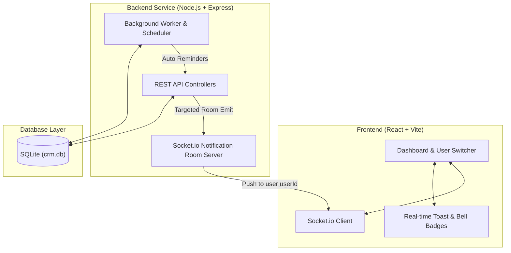

# Live CRM Notification System

A full-stack CRM application featuring targeted, real-time user notifications upon company/contact role assignments, persistent database storage, background worker process management, and an interactive multi-role dashboard.

---

## Technical Architecture



---

## Core Features

1. **CRM Entity Management**:
   - Create and view **Companies** and **Contacts**.
   - Relate contacts to companies.
   - Assign Users to Companies/Contacts with customizable roles (`Account Owner`, `Account Manager`, `Lead Agent`, `Technical Lead`, etc.).

2. **Targeted Real-Time Notifications**:
   - Implemented via WebSockets (`socket.io`).
   - Each authenticated user joins a private Socket room (`user:<userId>`).
   - When an Admin assigns a company or contact, **only the assigned user** receives the notification in real-time.
   - Non-assigned users do not receive the notification.

3. **Persistent Notifications & Read Tracking**:
   - Notifications are stored in SQLite database.
   - Unread badges update dynamically.
   - Users can mark individual notifications or all notifications as read.

4. **Automated & Manual Background Worker**:
   - A background process runs on an automated scheduler (every 45s).
   - Generates follow-up reminders and stale lead audit alerts.
   - Interactive **Worker & Scheduler Panel** allows reviewers to manually trigger background workflows for testing.

5. **Multi-User Switcher for Local Demo**:
   - Header dropdown allows switching active context between **Alex Vance (Admin)**, **Sarah Jenkins (Agent)**, **David Chen (Manager)**, and **Elena Rostova (Agent)** to test real-time notification delivery across tabs/roles instantly.

---

## Database Schema Design

### 1. `users`
| Column | Type | Constraints | Description |
|---|---|---|---|
| `id` | TEXT | PRIMARY KEY | Unique user identifier (`usr_...`) |
| `name` | TEXT | NOT NULL | User full name |
| `email` | TEXT | UNIQUE, NOT NULL | User email address |
| `role` | TEXT | NOT NULL | System role (`admin`, `agent`, `manager`) |
| `avatar` | TEXT | NOT NULL | Profile avatar image URL |
| `created_at` | DATETIME | DEFAULT CURRENT_TIMESTAMP | Registration timestamp |

### 2. `companies`
| Column | Type | Constraints | Description |
|---|---|---|---|
| `id` | TEXT | PRIMARY KEY | Company ID (`cmp_...`) |
| `name` | TEXT | NOT NULL | Organization name |
| `industry` | TEXT | NOT NULL | Industry sector |
| `domain` | TEXT | NOT NULL | Website domain |
| `status` | TEXT | DEFAULT 'prospect' | Account lifecycle status |
| `created_at` | DATETIME | DEFAULT CURRENT_TIMESTAMP | Created timestamp |

### 3. `contacts`
| Column | Type | Constraints | Description |
|---|---|---|---|
| `id` | TEXT | PRIMARY KEY | Contact ID (`cnt_...`) |
| `name` | TEXT | NOT NULL | Contact full name |
| `email` | TEXT | NOT NULL | Contact email address |
| `phone` | TEXT | NOT NULL | Contact phone number |
| `title` | TEXT | NOT NULL | Job title |
| `company_id` | TEXT | FK -> `companies.id` | Associated company |

### 4. `assignments`
| Column | Type | Constraints | Description |
|---|---|---|---|
| `id` | TEXT | PRIMARY KEY | Assignment ID (`asg_...`) |
| `entity_type` | TEXT | NOT NULL | `company` or `contact` |
| `entity_id` | TEXT | NOT NULL | Target entity ID |
| `user_id` | TEXT | FK -> `users.id` | Assigned team member |
| `role` | TEXT | NOT NULL | Assignment role (`Account Owner`, etc.) |
| `assigned_by_id` | TEXT | FK -> `users.id` | Assigner (Admin/User) |

### 5. `notifications`
| Column | Type | Constraints | Description |
|---|---|---|---|
| `id` | TEXT | PRIMARY KEY | Notification ID (`ntf_...`) |
| `user_id` | TEXT | FK -> `users.id` | Target recipient user |
| `type` | TEXT | NOT NULL | `assignment` or `reminder` |
| `title` | TEXT | NOT NULL | Short summary header |
| `message` | TEXT | NOT NULL | Full notification body |
| `is_read` | INTEGER | DEFAULT 0 | Read flag (`0` = unread, `1` = read) |
| `read_at` | DATETIME | NULL | Timestamp when marked as read |

---

## Quick Start & Local Setup

### Prerequisites
- **Node.js**: v18.0.0 or higher
- **npm**: v9.0.0 or higher

### 1. Install Dependencies
From project root:
```bash
npm run install:all
```
*(Or install separately: `cd server && npm install` and `cd client && npm install`)*

### 2. Run Automated Backend Tests
```bash
npm test
```

### 3. Start Development Servers
In two separate terminals:

**Terminal 1 (Backend Server - Port 5000)**:
```bash
npm run start:server
```

**Terminal 2 (Frontend Client - Port 3000)**:
```bash
npm run start:client
```

Open your browser at `http://localhost:3000`.

---

## Step-by-Step Demo & Evaluation Guide

Follow these steps to test the full requirement flow:

1. **Open Two Browser Windows / Tabs**:
   - Tab A: Open `http://localhost:3000` and ensure active user is **Alex Vance (Admin)** (top-right user switcher).
   - Tab B: Open `http://localhost:3000` and switch user to **Sarah Jenkins (Agent)**.

2. **Admin Assigns Company**:
   - In Tab A (Admin), navigate to **Companies**.
   - Click **Assign Role** on "Acme Corp".
   - Select User: **Sarah Jenkins**, Role: **Account Owner**.
   - Click **Confirm Assignment**.

3. **Verify Targeted Real-Time Notification**:
   - Immediately look at Tab B (Sarah Jenkins).
   - Observe the real-time toast alert pop up: *"You have been assigned to Acme Corp as Account Owner by Alex Vance."*
   - Notice the bell icon unread badge increases from 0 to 1 with sound/visual pulse.
   - In Tab A (Admin), verify that Alex Vance did **NOT** receive Sarah's assignment notification.

4. **View Notification List & Mark as Read**:
   - In Tab B (Sarah Jenkins), click the Bell icon or navigate to **Notifications**.
   - View the new unread assignment notification.
   - Click **Mark Read**. Verify unread counter updates to `0` and database updates `is_read = 1`.

5. **Test Background Process Flow**:
   - In Tab A, navigate to **Worker & Scheduler**.
   - Click **Execute Background Job Now** (or wait 45s for automated worker).
   - Observe the background worker executing, writing execution log to `background_jobs` table, and delivering an automated follow-up reminder notification to assigned users in real-time.

---

## Assumptions & Design Decisions

1. **Socket Room Targeted Scoping**: Rather than broadcasting events globally, Socket.io rooms are joined per `user_id`. Server emits only to `io.to('user:' + userId)`.
2. **Zero-Config Database**: SQLite (`better-sqlite3`) was selected to enable instant local evaluation without requiring external database server setup (Docker, Postgres, etc.).
3. **Multi-User Context Switcher**: Added an active user context switcher to make testing multi-user live notifications effortless without needing separate login flows or multiple machines.

---

## Live Deployment Instructions

- **Backend Hosting**: Deploy `server` to Render / Railway / Fly.io / Heroku.
- **Frontend Hosting**: Deploy `client` to Vercel / Netlify / Cloudflare Pages.
- Environment variables: `PORT=5000`, `CLIENT_ORIGIN=https://your-frontend-app.vercel.app`.
